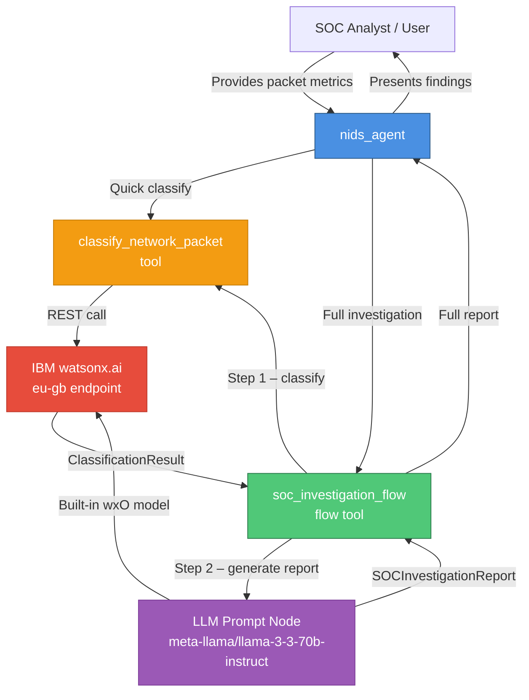
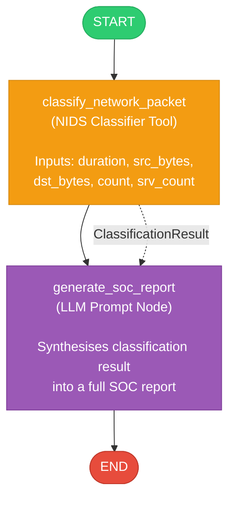
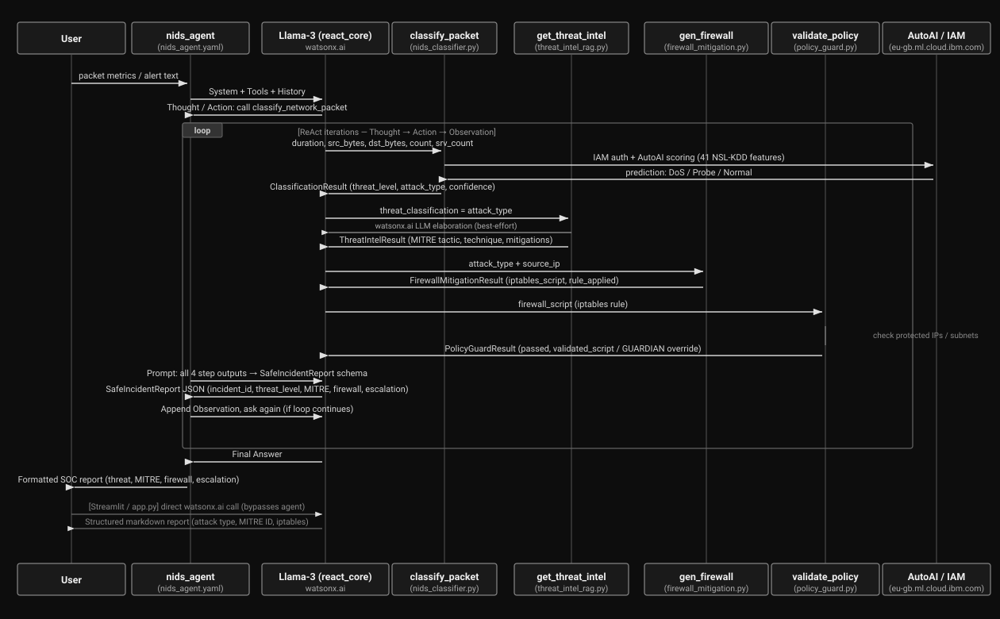

# NIDS – Network Intrusion Detection System (watsonx Orchestrate)

## Overview

This project implements a **Network Intrusion Detection System (NIDS)** as a watsonx Orchestrate native agent solution. It combines an IBM watsonx.ai Llama-3-70B classifier with a structured SOC investigation flow to detect, triage, and report on potential network intrusions in real time.

### Key Features

- **NIDS Classifier Tool** – classifies raw packet metrics into threat categories (DoS, Probe, R2L, U2R, Normal)
- **SOC Investigation Flow** – two-stage flow: packet classification → detailed investigation report generation
- **NIDS Agent** – conversational SOC assistant that guides analysts through threat analysis

---

## Architecture Diagram



---

## SOC Investigation Flow Diagram



---

## End-to-End Architecture Blueprint



---

## Project Structure

```
NIDS/
├── .env.example                  # Environment variables template
├── .gitignore                    # Git ignore rules
├── requirements.txt              # Project Python dependencies
├── app.py                        # Streamlit web chat UI
├── main_flow.py                  # Programmatic test harness
├── import-all.sh                 # CLI import script
├── nids-soc-agent-architecture-blueprint.svg # Vector architecture blueprint
├── README.md
│
├── tools/
│   ├── __init__.py
│   ├── nids_classifier.py        # @tool – classify_network_packet (AutoAI)
│   ├── threat_intel_rag.py       # @tool – get_threat_intel (MITRE ATT&CK)
│   ├── firewall_mitigation.py    # @tool – generate_firewall_mitigation (iptables)
│   └── policy_guard.py           # @tool – validate_safety_policy (Guardian Agent)
│
├── flows/
│   ├── __init__.py
│   └── soc_investigation_flow.py # @flow – soc_investigation_flow (v2 end-to-end pipeline)
│
├── agents/
│   └── nids_agent.yaml           # watsonx Orchestrate Native Agent definition
│
└── generated/
    └── soc_investigation_flow.json # Compiled flow spec
```

---

## Tools & Pipeline Stages

### 1. `classify_network_packet` (Python Tool)
Accepts 5 connection metrics and maps them to 41 NSL-KDD features for the deployed IBM Watson AutoAI classifier.
- **Inputs:** `duration`, `src_bytes`, `dst_bytes`, `count`, `srv_count`
- **Output:** `ClassificationResult` (`threat_detected`, `threat_level`, `attack_type`, `confidence_score`, `summary`, `recommendations`)

### 2. `get_threat_intel` (Threat Intelligence RAG Tool)
Queries the MITRE ATT&CK Knowledge Base and enriches findings with watsonx.ai Llama-3 elaboration.
- **Inputs:** `threat_classification` (e.g., "DoS", "Probe", "R2L", "U2R", "Normal")
- **Output:** `ThreatIntelResult` (`tactic`, `technique_id`, `technique_name`, `mitigations[]`, `detection_tips`, `soc_priority`, `llm_elaboration`)

### 3. `generate_firewall_mitigation` (Firewall Rule Tool)
Generates deterministic Linux `iptables` rules to isolate or rate-limit attack traffic.
- **Inputs:** `attack_type`, `source_ip`
- **Output:** `FirewallMitigationResult` (`iptables_script`, `rule_applied`, `explanation`)

### 4. `validate_safety_policy` (Guardian Policy Tool)
Validates firewall rules against enterprise safety policies to prevent accidental blacklisting of critical subnets (e.g., `10.0.0.0/8`, `192.168.0.0/16`, `127.0.0.1`, gateways).
- **Inputs:** `firewall_script`
- **Output:** `PolicyGuardResult` (`passed`, `violation_reason`, `validated_script`, `offending_ips`)

### 5. `soc_investigation_flow` (Flow Tool)
Chains all 4 tools in sequence and synthesises results via an LLM prompt node into a structured `SafeIncidentReport`.
- **Output fields:** `incident_id`, `executive_summary`, `threat_classification`, `threat_level`, `mitre_tactic`, `mitre_technique`, `mitre_mitigations_summary`, `firewall_action`, `firewall_policy_passed`, `escalation_required`, `ticket_priority`, `analyst_notes`

---

## Configuration

| Setting | Value |
|---------|-------|
| **watsonx.ai endpoint** | `https://eu-gb.ml.cloud.ibm.com/ml/v1/text/chat?version=2023-05-29` |
| **Model** | `meta-llama/llama-3-3-70b-instruct` |
| **Project ID** | `b5711429-279d-45a1-a962-8db58d7bee19` |

> **Security note:** Store your API key in an environment variable `WATSONX_API_KEY` rather than hard-coding it.
> ```bash
> export WATSONX_API_KEY="<your-key>"
> export WATSONX_PROJECT_ID="b5711429-279d-45a1-a962-8db58d7bee19"
> ```

---

## Usage

### 1. Import into watsonx Orchestrate

```bash
chmod +x import-all.sh
./import-all.sh
```

### 2. Launch the chat UI

```bash
orchestrate chat start
# Select: nids_agent
```

### 3. Test programmatically

```bash
export PYTHONPATH=/path/to/ibm-watsonx-orchestrate-adk/src:/path/to/ibm-watsonx-orchestrate-adk
python3 main_flow.py
```

---

## Example Interactions

**Quick classification:**
```
Classify this connection — duration: 0, src_bytes: 491, dst_bytes: 0, count: 2, srv_count: 2
```

**Full SOC investigation:**
```
Run a full SOC investigation for — duration: 0, src_bytes: 0, dst_bytes: 0, count: 511, srv_count: 511
```

**Normal traffic baseline:**
```
Classify this connection — duration: 8, src_bytes: 181, dst_bytes: 5450, count: 8, srv_count: 8
```

---

## Threat Level Reference

| Level      | Description                                          | SOC Action |
|------------|------------------------------------------------------|------------|
| `CRITICAL` | Active intrusion / exploit confirmed                 | Immediate escalation (P1) |
| `HIGH`     | Strong indicators of compromise                      | Escalate to Tier-2 (P2) |
| `MEDIUM`   | Suspicious activity, possible reconnaissance         | Investigate (P3) |
| `LOW`      | Minor anomaly, likely benign                         | Monitor (P4) |
| `NORMAL`   | No threat detected                                   | No action required |

---

## Prerequisites

- IBM watsonx Orchestrate CLI (`orchestrate`)
- Python ≥ 3.10
- `ibm_watsonx_orchestrate` ADK package
- `pydantic` ≥ 2.0

## License

MIT
